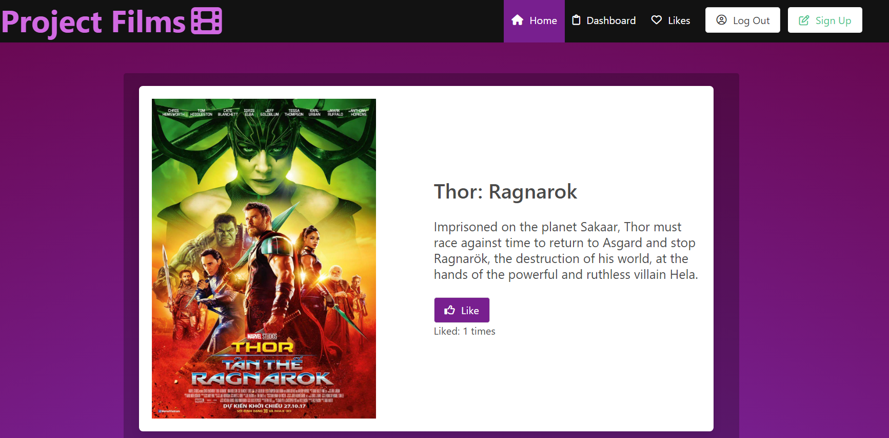
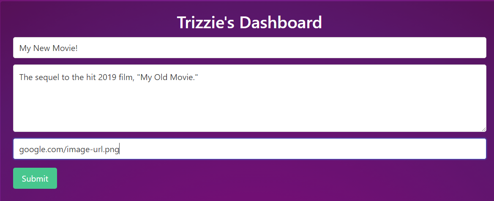
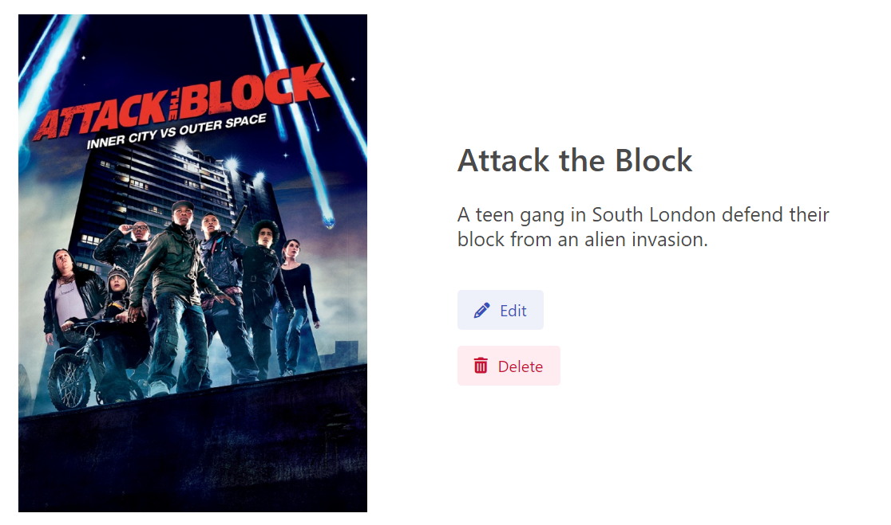

# Project Films

## Description

User sourced movie database.

## Table of Contents

- [Installation](#installation)
- [Usage](#usage)
- [Credits](#credits)
- [Published Application](#published-application)

## Installation

- create movies_db database in Mysql Workbench
- clone repo
- run `npm i` to install necessary packages
- run `node seeds/seeds.js` to seed 
- run `npm start` to run the application locally

## Usage

- View a list of movies on the homepage

- Signup or login

- Once logged in, view all movies created by the user
- Create a new movie including title, description and movie image from dashboard

- Edit a movie details

- From homepage, like other user's movies
- View previously liked movies from Likes page
- Use the Unlike button to remove existing likes

- Use Log Out button to log out

## Credits

- [Halle Be](https://github.com/slurpsz)
- [Jake Disharoon](https://github.com/JakeDish)
- [Trizzie Huynh](https://github.com/trizziehuynh)
- [Eric Nguyen](https://github.com/ericnguyen23)

## Published Application

[Deployed App](https://github.com/slurpsz)
